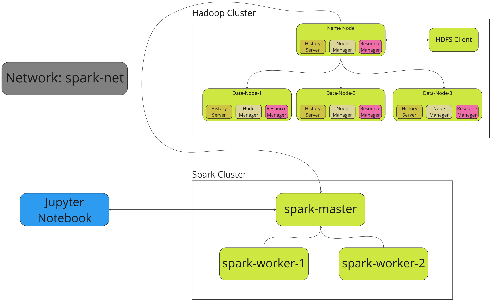

# Car-Sales-Analytics-Cloud-Computing-Project
INFS3208 Individual Project - Application of cloud-based ML to car sales data

Project ran on Google Cloud VM with HDFS storage. Application of docker-compose to run Spark nodes and HDFS, along with Jupyter notebooks (see workflow below).

